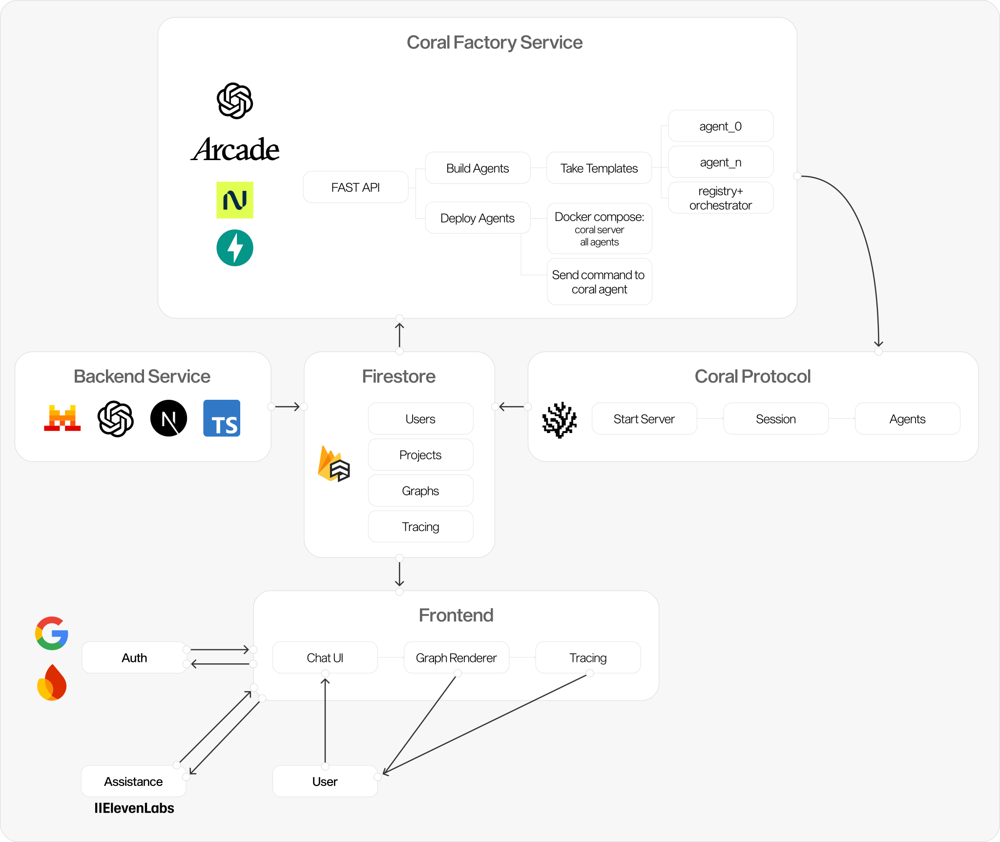

# Reef - AI Agent Workflow Platform

**"Lovable for AI Agents"** - A comprehensive platform for building, deploying, and managing AI agent workflows effortlessly. Reef enables users to create intelligent multi-agent systems through natural language interfaces and visual workflow builders.

## 🚀 Overview

Reef consists of two main components that work together to provide a complete AI agent workflow solution:

- **Frontend** - A Next.js web application providing user interfaces for project management, AI chat, and visual workflow design
- **Coral Factory** - A FastAPI-based backend system for creating, configuring, and deploying AI agent workflows with containerized execution

### Key Features

- 🤖 **Natural Language Workflow Creation** - Build complex agent workflows through conversational AI
- 🎨 **Visual Workflow Designer** - Interactive canvas for designing agent relationships and data flow
- 🔒 **User Authentication** - Firebase-powered secure user management
- 📊 **Real-time Monitoring** - Live trace viewing and performance analytics
- 🐳 **Containerized Deployment** - Docker-based agent deployment and orchestration
- 🛠️ **Tool Integration** - Extensive toolkit for agent capabilities via Arcade
- ☁️ **Scalable Architecture** - Multi-agent coordination with Kotlin-based orchestration

## 📸 Screenshots


## 🏗️ Project Structure

```
reef/
├── frontend/                    # Next.js Web Application
│   ├── src/
│   │   ├── app/                # Next.js App Router pages
│   │   ├── components/         # React components (UI, workflow, chat)
│   │   ├── contexts/           # Authentication and state management
│   │   ├── lib/               # Utilities and Firebase configuration
│   │   └── types/             # TypeScript type definitions
│   ├── public/                # Static assets
│   └── README.md              # Frontend documentation
├── coral_factory/              # AI Agent Workflow Backend
│   ├── app.py                 # FastAPI server with authentication
│   ├── factory/               # Workflow creation engine
│   │   ├── from_json.py       # Core workflow generation logic
│   │   └── name_less/         # Agent templates
│   ├── hosting/               # Docker deployment system
│   │   ├── main.py           # Container orchestration
│   │   └── shared/           # Coral server and shared resources
│   └── README.md             # Backend documentation
└── README.md                 # This file
```

## 🎨 Frontend - Web Application

The user-facing web application built with modern React technologies:

**Core Technologies:**
- Next.js 15 with App Router and TypeScript
- Tailwind CSS with custom design system
- shadcn/ui components built on Radix UI
- Firebase for authentication and real-time data
- AI SDK for LLM integration
- React Flow for workflow visualization

**Key Features:**
- Landing page with feature showcase
- User authentication and project management
- AI-powered chat interface for workflow creation
- Visual workflow canvas with drag-and-drop
- Real-time trace viewer for monitoring
- Responsive design for all devices

## ⚙️ Coral Factory - Backend System

The AI agent workflow creation and deployment backend:

**Core Technologies:**
- FastAPI server with bearer token authentication
- Python-based workflow generation engine
- Docker containerization with compose orchestration
- Kotlin coral-server for agent coordination
- Firebase integration for tracing
- OpenAI Agents SDK for LLM workflows

**Key Features:**
- JSON-to-workflow conversion system
- Template-based agent generation
- Dynamic Docker deployment
- Multi-agent coordination and communication
- Tool integration via Arcade toolkit
- Real-time execution monitoring

## 🏛️ System Architecture

Reef follows a microservices architecture with clear separation of concerns:

```
┌─────────────────┐    API Calls    ┌──────────────────────┐
│                 │ ───────────────> │                      │
│   Frontend      │                  │   Coral Factory      │
│   (Next.js)     │ <─────────────── │   (FastAPI)          │
│                 │   WebSocket      │                      │
└─────────────────┘   Updates        └──────────────────────┘
         │                                        │
         │ Firebase Auth                          │ Docker Compose
         │ & Firestore                           │
         ▼                                        ▼
┌─────────────────┐                  ┌──────────────────────┐
│                 │                  │  Agent Containers    │
│   Firebase      │                  │  ┌─────────────────┐ │
│   - Auth        │                  │  │ Coral Server    │ │
│   - Firestore   │ <───────────────── │ (Kotlin)        │ │
│   - Tracing     │    Trace Data    │  └─────────────────┘ │
│                 │                  │  ┌─────────────────┐ │
└─────────────────┘                  │  │ Research Agents │ │
                                     │  │ (Python)        │ │
                                     │  └─────────────────┘ │
                                     └──────────────────────┘
```

### Data Flow
1. **User Interaction** - Users interact with the frontend to create projects and workflows
2. **Workflow Creation** - Frontend sends workflow configs to Coral Factory via API
3. **Agent Generation** - Coral Factory converts configs to executable agent code
4. **Deployment** - Docker containers are created and orchestrated for each workflow
5. **Execution** - Agents run in containers, communicating through Coral Server
6. **Monitoring** - Real-time traces sent to Firebase, displayed in frontend

## 🚀 Quick Start

### Prerequisites
- Node.js 18+ and npm/bun
- Python 3.8+
- Docker and Docker Compose
- Firebase project (for auth and database)
- OpenAI API key

### Development Setup

1. **Clone the repository:**
   ```bash
   git clone <repository-url>
   cd reef
   ```

2. **Set up Frontend:**
   ```bash
   cd frontend
   cp env_example .env.local
   # Configure Firebase and OpenAI keys in .env.local
   npm install
   npm run dev
   ```
   Frontend available at: http://localhost:3000

3. **Set up Coral Factory:**
   ```bash
   cd coral_factory
   python3 -m venv venv
   source venv/bin/activate
   pip install fastapi uvicorn pydantic python-dotenv pyyaml toml
   # Configure environment variables
   uvicorn app:app --host 0.0.0.0 --port 8001
   ```
   Backend available at: http://localhost:8001

## 📚 Documentation

Each component has detailed documentation:
- [Frontend README](./frontend/README.md) - Web application setup and development
- [Coral Factory README](./coral_factory/README.md) - Backend system and deployment

## 🚢 Production Deployment

### Frontend Deployment (Vercel)
```bash
cd frontend
npm run build
# Deploy to Vercel with environment variables configured
```

### Backend Deployment (Docker)
```bash
cd coral_factory
# Configure production environment variables
docker-compose up -d
# Or deploy to cloud provider with Docker support
```

### Environment Configuration
Ensure the following are configured in production:
- Firebase project with Authentication and Firestore enabled
- OpenAI API key for LLM capabilities
- Mistral API key (optional, for alternative models)
- Arcade API key for tool integrations
- Docker environment for agent execution

## 🤝 Contributing

We welcome contributions to Reef! Please follow these steps:

1. Fork the repository
2. Create a feature branch (`git checkout -b feature/amazing-feature`)
3. Make your changes following the existing code style
4. Test your changes thoroughly
5. Commit your changes (`git commit -m 'Add amazing feature'`)
6. Push to the branch (`git push origin feature/amazing-feature`)
7. Open a Pull Request

### Development Guidelines
- Follow TypeScript best practices in frontend code
- Use proper type definitions and error handling
- Write clear commit messages
- Update documentation for new features
- Test both frontend and backend integration

## 📄 License

This project is licensed under the MIT License - see the [LICENSE](LICENSE) file for details.

## 🙋‍♂️ Support

For questions, issues, or feature requests:
- Open an issue on GitHub
- Check the component-specific README files for detailed documentation
- Review the system architecture section for understanding component interactions
