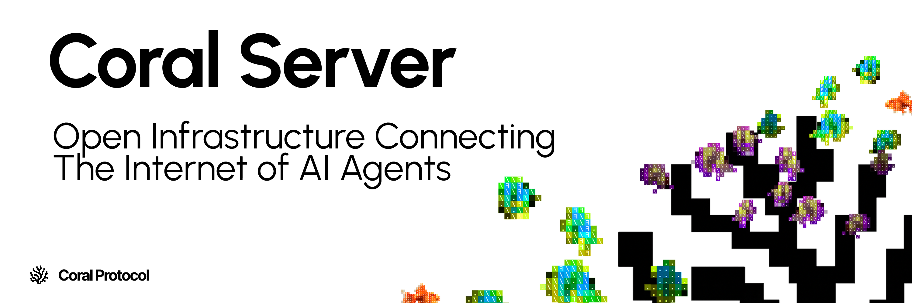

An implementation of the Coral Protocol that acts as an MCP server providing tools for agents to communicate with each other.

<br/>
<div align="center">

**[How to Run](#how-to-run)** ┃ **[Configuration](#configuration)** ┃ **[Multi-Agent Quick Start](https://docs.coralprotocol.org/setup/quickstart)** ┃ **[Contributing](#contribution-guidelines)** 

</div>
<br/>

## What is Coral Server?

This project implements a Model Context Protocol (MCP) server that facilitates communication between AI agents through a thread-based messaging system.


Currently, it provides a set of tools that allow agents to:

- Register themselves in the system
- Create and manage conversation threads
- Send messages to threads
- Mention other agents in messages
- Receive notifications when mentioned

## How to Run

### Using Gradle

Clone this repository, and in that folder run:
```bash
./gradlew run
```

### Using Docker

Coral Server is available on ghcr.io:
```bash
docker run \
  -p 5555:5555 \ # expose port 5555 from the container
  -v /path/to/your/registry.toml:/config/registry.toml # mount your registry.toml
  -v /var/run/docker.sock:/var/run/docker.sock # mount the docker socket to support docker agents
  ghcr.io/coral-protocol/coral-server
```

> [!WARNING]
> Our Coral Server docker image is *very* minimal - which means the executable runtime will **not** work. All agents you use must use the Docker runtime, which means you **must** give your server container access to your host's docker socket.
>
> See [here](https://docs.coralprotocol.org/setup/coral-server-applications#docker-recommended) for more information on giving your docker container access to Docker.


## Configuration
Coral Server has two files for configuration - `config.toml`, which has general configuration options like port, docker socket, etc, and `registry.toml`, which defines the agent registry for your server.

> [!TIP]
> To get a sense of all available options, see [`full-config.toml`](https://github.com/Coral-Protocol/coral-server/blob/master/src/main/resources/full-registry.toml) & [`full-registry.toml`](https://github.com/Coral-Protocol/coral-server/blob/master/src/main/resources/full-registry.toml)

> [!NOTE]
> While coral server has default config files, it's recommended you create your own `registry.toml`/`config.toml`, and point coral server to them with the `REGISTRY_FILE_PATH`/`CONFIG_FILE_PATH` environment variables.

## Philosophy

Open infrastructure for the Society of AI Agents

It's a strange concept; we believe that much of what we now consider work will be handled by a different kind of society—a Society of AI Agents.

To bridge this gap, Coral Protocol was built as the connective tissue of this society. Coral is designed to enable agents to discover one another, communicate securely, exchange value, and scale their collaborative efforts from any framework.

We theorize that not only will this fix many problems with the composability of multi-agent systems, but it will also unlock their full potential to be much more capable and safe, this is due to the graph-like structure that prevents any one agent from holding too much power or becoming overwhelmed with too much responsibility.

## Contribution Guidelines

We welcome contributions! Email us at [hello@coralprotocol.org](mailto:hello@coralprotocol.org) or join our Discord [here](https://discord.gg/rMQc2uWXhj) to connect with the developer team. Feel free to open issues or submit pull requests.

Thanks for checking out the project, we hope you like it!

### Development
IntelliJ IDEA is recommended for development. The project uses Gradle as the build system.

To clone and import the project:
Go to File > New > Project from Version Control > Git.
enter `git@github.com:Coral-Protocol/coral-server.git`
Click Clone.

### Running from IntelliJ IDEA
You can click the play button next to the main method in the `Main.kt` file to run the server directly from IntelliJ IDEA.

## Session and Messaging API (Quickstart)

This section shows how to:

- Create a session via HTTP
- Connect agents over SSE
- Send messages to agents/threads via the API

### 1) Create a session

Endpoint: `POST /api/v1/sessions`

Request body (`applicationId`, `privacyKey`, and an agent graph):

```bash
curl -sS -X POST \
  http://localhost:5555/api/v1/sessions \
  -H 'Content-Type: application/json' \
  -d '{
    "applicationId": "myApp",
    "privacyKey": "myPrivacyKey",
    "agentGraphRequest": {
      "agents": [
        {
          "id": { "name": "interface", "version": "0.0.1" },
          "name": "interface",
          "description": "User interface agent",
          "options": {},
          "systemPrompt": null,
          "blocking": true,
          "customToolAccess": [],
          "coralPlugins": [],
          "provider": { "type": "local", "runtime": "executable" }
        }
      ],
      "groups": [["interface"]],
      "customTools": {}
    }
  }'
```

Response:

```json
{
  "sessionId": "<SESSION_ID>",
  "applicationId": "myApp",
  "privacyKey": "myPrivacyKey"
}
```

Note: Agent IDs must exist in your registry (`registry.toml`). See `GET /api/v1/agents` for available agents.

### 2) Connect an agent via SSE

Agents must establish an SSE connection before you can send messages. Each agent connects with its own `agentId`:

Production SSE (validates session):

```bash
curl -N \
  "http://localhost:5555/sse/v1/myApp/myPrivacyKey/<SESSION_ID>?agentId=interface&agentDescription=Interface"
```

Dev mode SSE (auto-creates session if missing, skips validation):

```bash
curl -N \
  "http://localhost:5555/sse/v1/devmode/myApp/myPrivacyKey/<SESSION_ID>?agentId=interface&waitForAgents=1"
```

When an agent connects, the server internally provisions an MCP server transport and assigns a transient `sessionId` for message posting. You do not need to compute this ID; the server plumbs it through for you when you use the message endpoint below.

### 3) Send messages via the API

The message endpoint is used internally by the MCP transport. You call it after the SSE is established. It expects a `sessionId` query param equal to the transport session ID assigned during SSE connect; the easiest way to use it is to let the MCP client code handle it. If you are building custom tooling, follow this pattern:

Production message endpoint:

```
POST /api/v1/message/{applicationId}/{privacyKey}/{coralSessionId}?sessionId=<transportSessionId>
```

Dev mode message endpoint:

```
POST /api/v1/message/devmode/{applicationId}/{privacyKey}/{coralSessionId}?sessionId=<transportSessionId>
```

Body: raw MCP message envelope (the server forwards it to the connected MCP transport). If you want a simple HTTP API for threads/messages without MCP envelopes, use the debug helpers below.

### 4) Debug helpers: create a thread and send a message

Create thread:

```
POST /api/v1/debug/thread/{applicationId}/{privacyKey}/{coralSessionId}/{debugAgentId}
Content-Type: application/json

{
  "threadName": "general",
  "participantIds": ["interface"]
}
```

Send message:

```
POST /api/v1/debug/thread/sendMessage/{applicationId}/{privacyKey}/{coralSessionId}/{debugAgentId}
Content-Type: application/json

{
  "threadId": "<THREAD_ID>",
  "content": "Hello agents!",
  "mentions": ["interface"]
}
```

Notes:

- `debugAgentId` must correspond to a connected agent (`agentId` you used in SSE). The thread must include participants before they can receive messages.
- Use `GET /api/v1/telemetry/{sessionId}/{threadId}/{messageId}` to retrieve telemetry for a specific message, and `POST /api/v1/telemetry/{sessionId}` to attach telemetry.

### 5) Discover available agents

List registry agents:

```bash
curl -sS http://localhost:5555/api/v1/agents | jq
```

This returns agent IDs, available runtimes, options, and export settings. Use these values when building the `agentGraphRequest` for session creation.

### 6) API Reference UI

An OpenAPI spec is served at `/api_v1.json`. A light docs UI is available at:

```
GET /api/v1/v1/docs
```

It renders a reference UI for the same OpenAPI spec.


